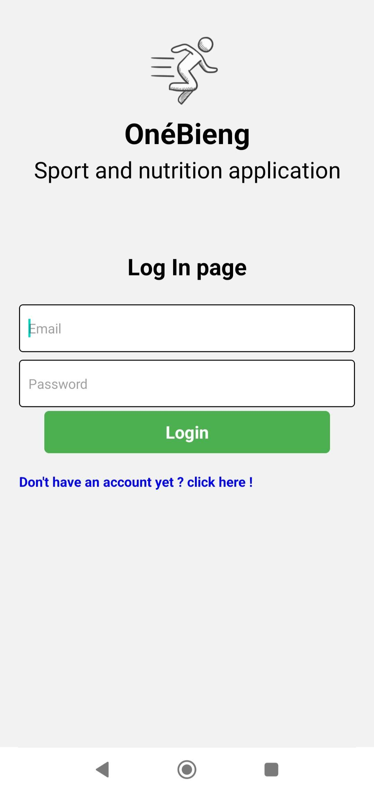
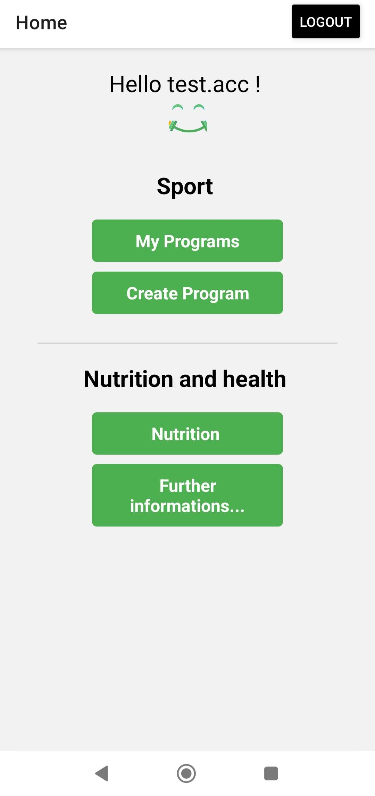
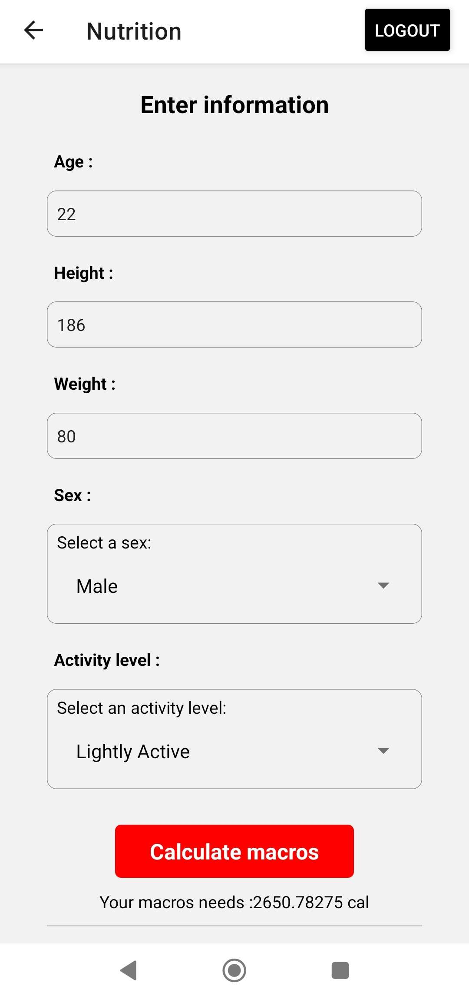
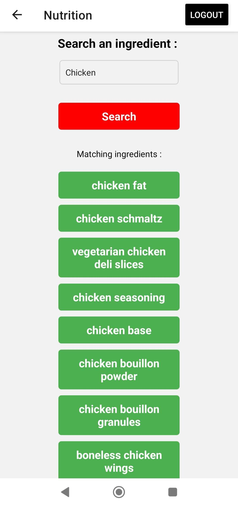
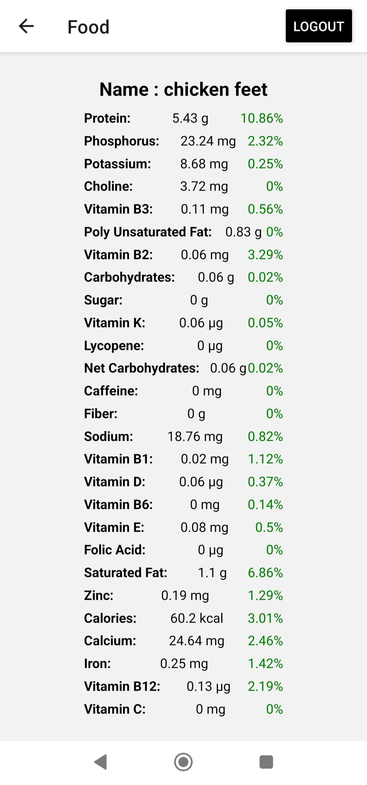
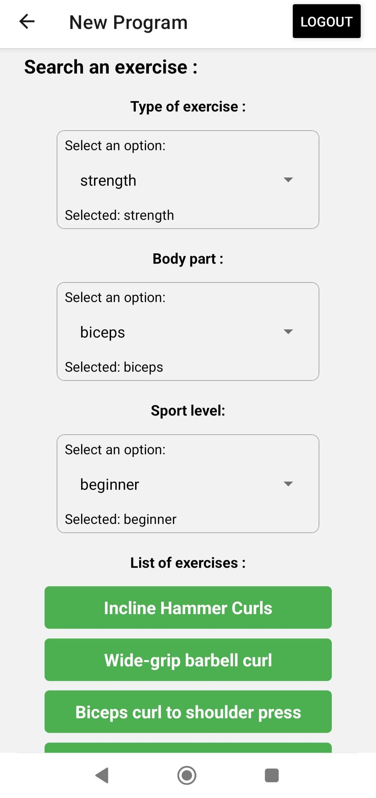
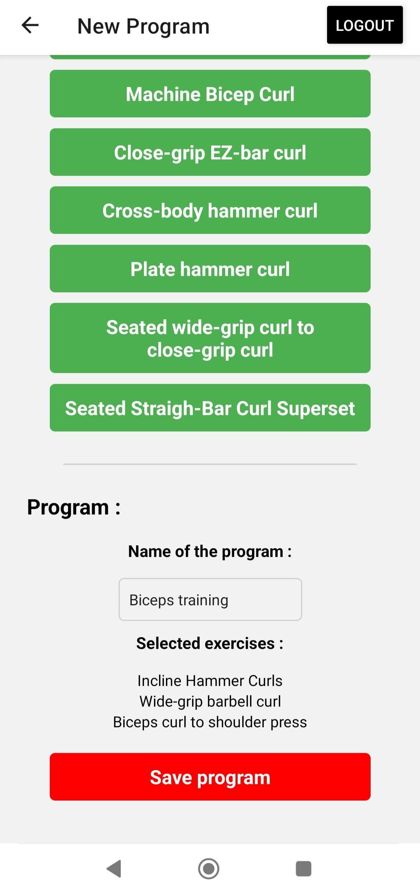
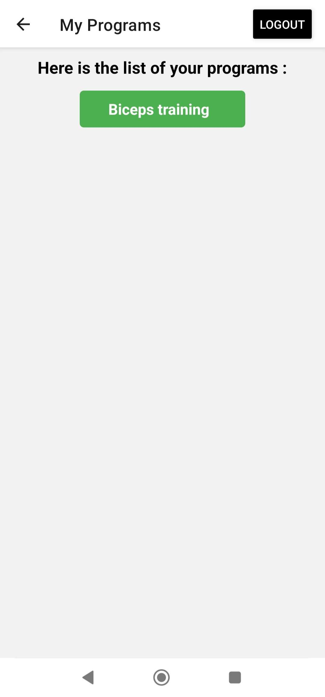
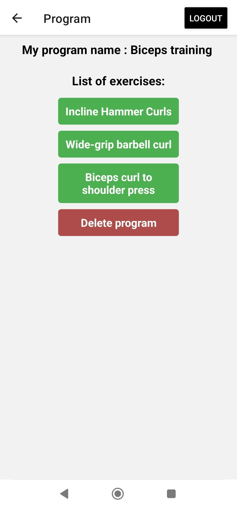
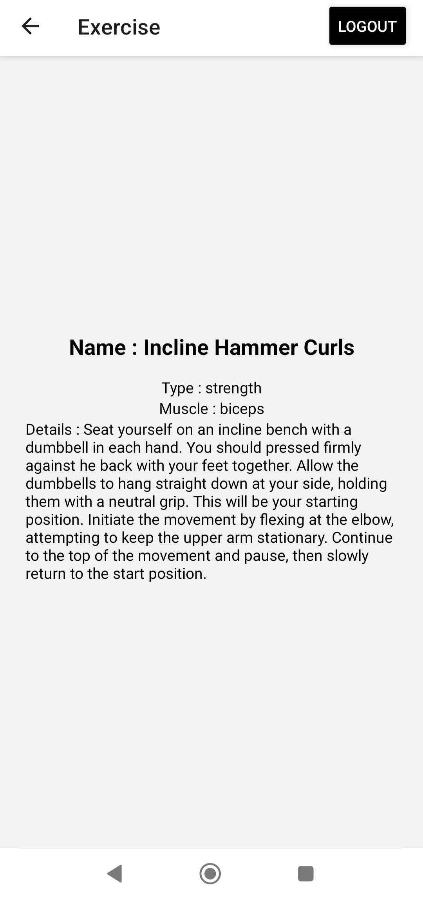

# OnéBieng 

Application mobile de sport et nutrition développée avec React Native et Expo.

---

## Aperçu

| Login | Accueil | Nutrition |
|-------|---------|-----------|
|  |  |  |

| Recherche d'aliments | Détail d'un ingrédient | Recherche d'exercices |
|----------------------|------------------------|----------------------|
|  |  |  |

| Création de programme | Mes programmes | Détail d'un programme | Détail d'un exercice |
|-----------------------|----------------|----------------------|----------------------|
|  |  |  |  |

---

## Fonctionnalités

- Authentification par email / mot de passe via Firebase
- Création de programmes sportifs personnalisés
- Recherche d'exercices filtrés par type, muscle ciblé et niveau de difficulté
- Consultation et suppression de ses programmes
- Calcul des besoins caloriques journaliers (formule de Harris-Benedict)
- Recherche d'aliments et consultation de leurs valeurs nutritionnelles

---

## Technologies utilisées

- [React Native](https://reactnative.dev/) — framework mobile
- [Expo](https://expo.dev/) — environnement de développement
- [Firebase](https://firebase.google.com/) — authentification et base de données (Firestore)
- [API Ninjas](https://api-ninjas.com/) — données sur les exercices sportifs
- [Spoonacular](https://spoonacular.com/food-api) — données nutritionnelles

---

## Installation

### Prérequis

- [Node.js](https://nodejs.org/)
- [Expo Go](https://expo.dev/client) sur votre téléphone
- Un compte [API Ninjas](https://api-ninjas.com/) et [Spoonacular](https://spoonacular.com/food-api) pour obtenir vos clés API
- Un projet [Firebase](https://console.firebase.google.com/) configuré (voir étape 3)

### Étapes

**1. Cloner le projet**

```bash
git clone https://github.com/TheoSergeJean/Onebieng.git
cd Onebieng
```

**2. Installer les dépendances**

Compatible npm et yarn :
```bash
npm install
# ou
yarn install
```

**3. Configurer Firebase**

- Créez un projet sur [Firebase Console](https://console.firebase.google.com/)
- Activez **Authentication** avec la méthode Email/Password
- Créez une base de données **Firestore**
- Récupérez votre configuration dans Paramètres du projet → Vos applications
- Configurez les Security Rules Firestore :

```javascript
rules_version = '2';
service cloud.firestore {
  match /databases/{database}/documents {
    match /programs/{document} {
      allow read: if request.auth != null && resource.data.userId == request.auth.uid;
      allow write: if request.auth != null && request.resource.data.userId == request.auth.uid;
      allow delete: if request.auth != null && resource.data.userId == request.auth.uid;
    }
  }
}
```

**4. Configurer les variables d'environnement**

Créez un fichier `.env` à la racine du projet en vous basant sur `.env.example` :

```env
EXPO_PUBLIC_FIREBASE_API_KEY=votre_clé_firebase
EXPO_PUBLIC_FIREBASE_AUTH_DOMAIN=votre_auth_domain
EXPO_PUBLIC_FIREBASE_PROJECT_ID=votre_project_id
EXPO_PUBLIC_FIREBASE_STORAGE_BUCKET=votre_storage_bucket
EXPO_PUBLIC_FIREBASE_MESSAGING_SENDER_ID=votre_sender_id
EXPO_PUBLIC_FIREBASE_APP_ID=votre_app_id
EXPO_PUBLIC_API_NINJA_KEY=votre_clé_api_ninjas
EXPO_PUBLIC_SPOONACULAR_KEY=votre_clé_spoonacular
```

**5. Lancer l'application**

```bash
npx expo start --lan
# ou
yarn expo start --lan
```

Scannez le QR code avec Expo Go (Android) ou l'appareil photo (iOS). Assurez-vous que votre téléphone et votre ordinateur sont sur le même réseau WiFi.

---

## Améliorations potentielles

- Modification d'un programme existant
- Suivi de l'historique des séances
- Graphiques de progression nutritionnelle

---

## Auteur

**Théo Serge Jean** — projet réalisé en 2ème année d'école d'ingénieur avec modifications ultérieures
